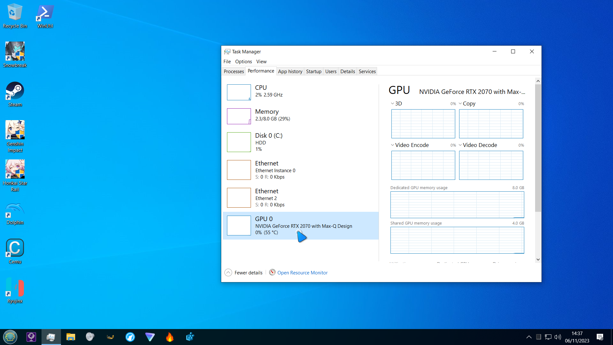

# dotfiles

# My Arch Linux Hyprland Setup

GIF Preview

# My Windows 10 Virtual Machine Setup

(i don't have any fancy features or customizations enabled since I am trying to reduce RAM usage as much as possible)

# Windows or Linux?

While they're both amazing operating systems, they have their differences. I choose **Linux** over Windows 10 because:

- Linux is [Open Source](https://en.wikipedia.org/wiki/Open_source) (I like to know I'm in safe hands and not in the dark)
- Linux is a [UNIX](https://en.wikipedia.org/wiki/Unix)-like operating system which is my preferred choice. It feels more natural to use. Terminals are the most important!
- **Customization**: It's endless! I can make my system function and look exactly how I like (which is a big thing to me)
- I genuinely like [Window Managers](https://en.wikipedia.org/wiki/Window_manager) more then desktops (I'm using [Hyprland](https://wiki.archlinux.org/title/Hyprland)). They are more functional and easier to use. Having two windows snap by side by default and full screen while only one window is open is just perfect.
- [Package Managers](https://en.wikipedia.org/wiki/Package_manager) are just a life saver! Incredibly easy to install applications!
- I like how Linux is community driven with so much choice and is not owned by a single company which is closed source (Microsoft)
- Linux uses significantly less ram then Windows does by default (depending on the setup)

# Configuration

<pre>
- Laptop                    Blade 15 Base Model (Early 2020) - RZ4
- Storage Device            NVME Drive (480GB) with Windows 10
- Storage Device            External SSD (480GB) with Arch Linux
- Virtualization Software   KVM/QEMU setup with NVIDIA GPU passthrough
- Window Manager            Hyprland
- Display Server            Wayland
</pre>

# How I use my system

- I'm running [Arch Linux](https://archlinux.org) on my laptop.
- If I want to play games I boot into my windows 10 [VM](https://en.wikipedia.org/wiki/Virtual_machine) by [passing through my NVIDIA GPU](https://wiki.archlinux.org/title/PCI_passthrough_via_OVMF).
- I use my Intel [iGPU](https://www.howtogeek.com/781784/what-is-integrated-graphics) for my [Wayland](https://wiki.archlinux.org/title/Wayland) session so I can have both environments simultaneously running. This makes switching super easy!
- However, due to this setup, I tend to use my [Windows 10](https://en.wikipedia.org/wiki/Windows_10) virtual machine for anything GPU intensive.
- A downside to this is my iGPU doesn't support external monitors so I can only use one screen while in Arch Linux :-(

# Q&A

- Why do I use Windows 10 for games? Because of [anticheat](https://en.wikipedia.org/wiki/Category:Anti-cheat_software): It is not available on Linux.
- [Xorg](https://wiki.archlinux.org/title/Xorg) vs Wayland, my experience? This is hard because so many things work on Xorg and are easier. However, Wayland eliminates screen tearing and is extremely smooth! Ultimately, I chose Wayland because it's still actively worked on and because Hyprland is so smooth! :-)
