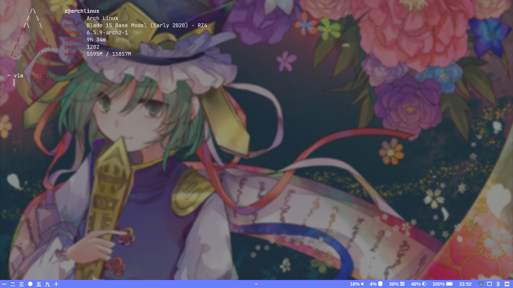

# dotfiles

# My Arch Linux Hyprland Setup

# My Windows 10 Virtual Machine Setup

(i don't have any fancy features or customizations enabled since I am trying to reduce RAM usage as much as possible)

# Windows or Linux?

While they're both amazing operating systems, they have their differences. I choose **Linux** over Windows 10 because:

- Linux is **open source** (I like to know I'm in safe hands and not in the dark)
- Linux is a **UNIX**-like operating system which is my preferred choice. It feels more natural to use. Terminals are the most important!
- **Customization**: It's endless! I can make my system function and look exactly how I like (which is a big thing to me)
- I genuinely like **Window Manager**s more then desktops. They are more functional and easier to use. Having two windows snap by side by default and full screen while only one window is open is just perfect.
- **Package manager**s are just a life saver! Incredibly easy to install applications!
- I like how Linux is community driven with so much choice and is not owned by a single company which is closed source (Microsoft)
- Linux uses significantly less ram then Windows does by default (depending on your setup)

# Configuration

- Laptop Blade 15 Base Model (Early 2020) - RZ4
- Storage Device NVME Drive (480GB) with Windows 10
- Storage Device External SSD (480GB) with Arch Linux
- Virtualization Software KVM/QEMU setup with NVIDIA GPU passthrough
- Window Manager Hyprland
- Display Server Wayland

# How I use my system

While in Arch Linux, If I want to play games I boot into my windows 10 virtualized environment by passing through my NVIDIA GPU. I use my Intel iGPU for my wayland session so I can have both environments simultaneously running. This makes switching super easy! Due to this setup, I tend to use my windows 10 virtual machine for anything GPU intensive.  
However, at anytime I can still boot into windows normally because the virtual machine is based on a real NVME drive.  
**-** A downside to this is my iGPU doesn't support external monitors so I can only use one screen while in Arch Linux.

# Q&A

- Why do I use windows 10 for games? Because of **anticheat**.
- X11 vs Wayland, my experience? This is hard because so many things work on X11 and are easier. However, wayland eliminates screentearing and is extremely smooth! Ultimately I chose wayland because it's still actively worked on and **Hyprland** :-)
